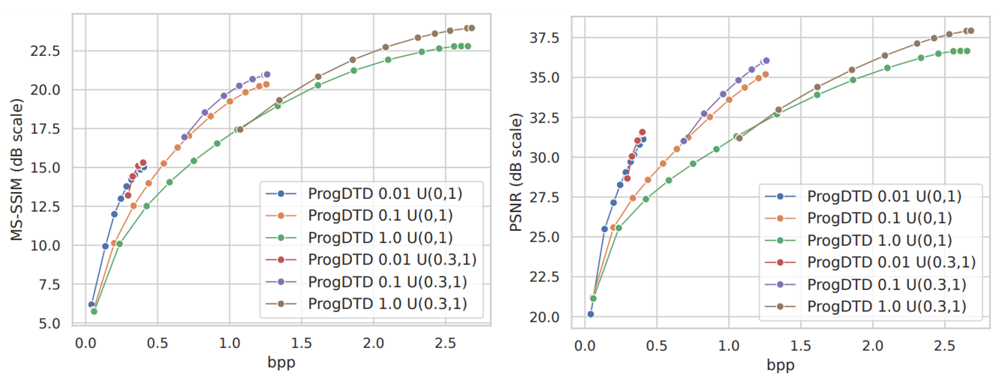

# ProgDTD: Progressive Learned Image Compression with Double-Tail-Drop Training (CVPRW-2023)

Welcome to the ProgDTD repository! This repository contains the code for reproducing the results presented in the paper titled "ProgDTD: Progressive Learned Image Compression with Double-Tail-Drop Training (CVPRW-2023)."

## About ProgDTD

ProgDTD is based on the observation that the information stored within the bottleneck of a compression model often varies in importance. To achieve progressive compression, ProgDTD modifies the training process to prioritize and store data in the bottleneck according to its importance. This allows us to transmit data in the order of its sorted index which results a progressive compression model. Key features of ProgDTD include:

- Designed for CNN-based learned image compression models.
- No need for additional parameters.
- Customizable range of progressiveness.

In our experiments, we applied ProgDTD to the [hyperprior model](https://arxiv.org/abs/1802.01436), a commonly used structure in learned image compression and used [this](https://github.com/facebookresearch/NeuralCompression) as our baseline code.

## Installation Instructions

Follow these instructions to set up the required Python environment for running ProgDTD. Make sure you have the following prerequisites installed on your system:

- [Python](https://www.python.org/downloads/) (Python 3.x recommended)
- [pip](https://pip.pypa.io/en/stable/installation/) (Python package manager)
- [virtualenv](https://virtualenv.pypa.io/en/latest/installation.html) (Python environment creator)
### Installation

1. Clone this Git repository to your local machine using the following command:

   ```bash
   git clone https://github.com/ds-kiel/ProgDTD
   cd ProgDTD
   ```
2. Create a virtual Python environment to isolate the project dependencies. You can do this using venv if you're using Python 3.3 or newer, or virtualenv if you're using an older version of Python. Replace <env_name> with your preferred environment name:

    ```bash
    virtualenv progdtd
    source progdtd/bin/activate
    ``` 
3. Install the necessary Python packages by running:

   ```bash
   pip install -r req.txt
   ```


## Usage

### Train from Scratch

To train a model from scratch, execute the following command:

```bash
python train.py
```

### Trained models
You can download the pre-trained models [here](https://drive.google.com/drive/folders/1tO9yAohVi4uqEXcKLa9iyVKTHA1A2ztq?usp=sharing). In this folder, there are 6 models that have been trained with different Lambdas and progressiveness ranges.

### Evaluation on the KODAK Dataset

To evaluate the model on the KODAK dataset, run:

```bash
python val.py
```

### Compression Function

If you want to use ProgDTD compression function in your own code, you can import it as follows:

```python
from val import ProgDTD

bpp, psnr, msssim, ssim = ProgDTD(
    model_address,  # Trained model address
    p,  # Latent usage percentage
    Lambda,  # Hyperparameter
    dataset_address  # Validation folder address (images should be 512x512)
)
```

### Results on KODAK




Feel free to explore and experiment with ProgDTD to enhance your image compression tasks with progressive capabilities. If you have any questions or encounter issues, please refer to the documentation or reach out to the repository's maintainers for assistance.


```
@InProceedings{Hojjat_2023_CVPR,
    author    = {Hojjat, Ali and Haberer, Janek and Landsiedel, Olaf},
    title     = {ProgDTD: Progressive Learned Image Compression With Double-Tail-Drop Training},
    booktitle = {Proceedings of the IEEE/CVF Conference on Computer Vision and Pattern Recognition (CVPR) Workshops},
    month     = {June},
    year      = {2023},
    pages     = {1130-1139}
}
```